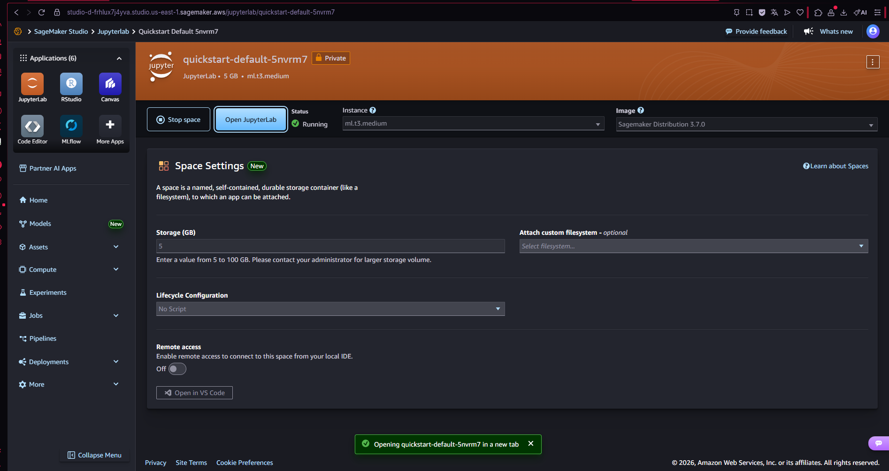
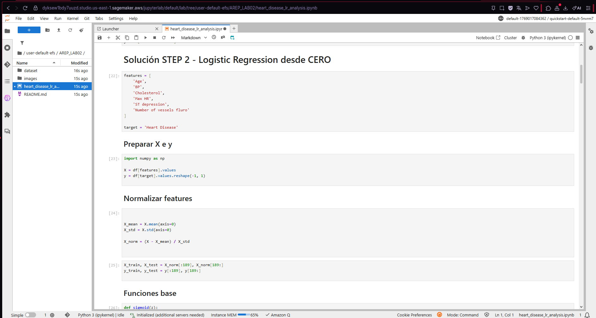
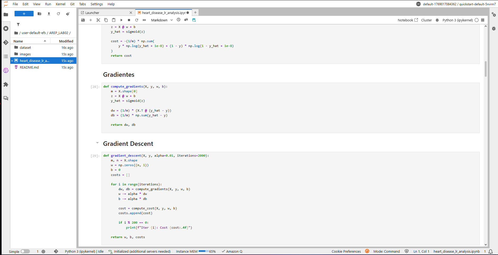
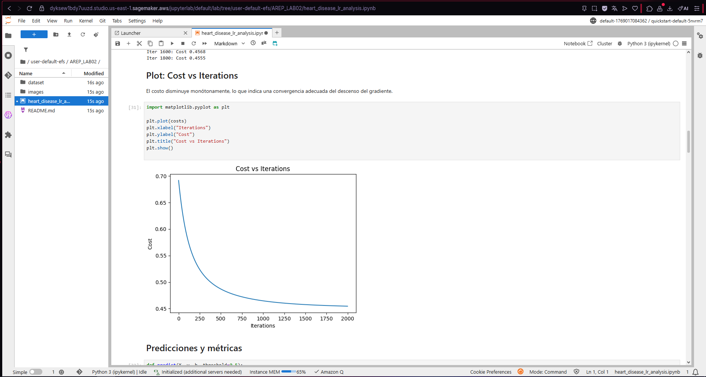
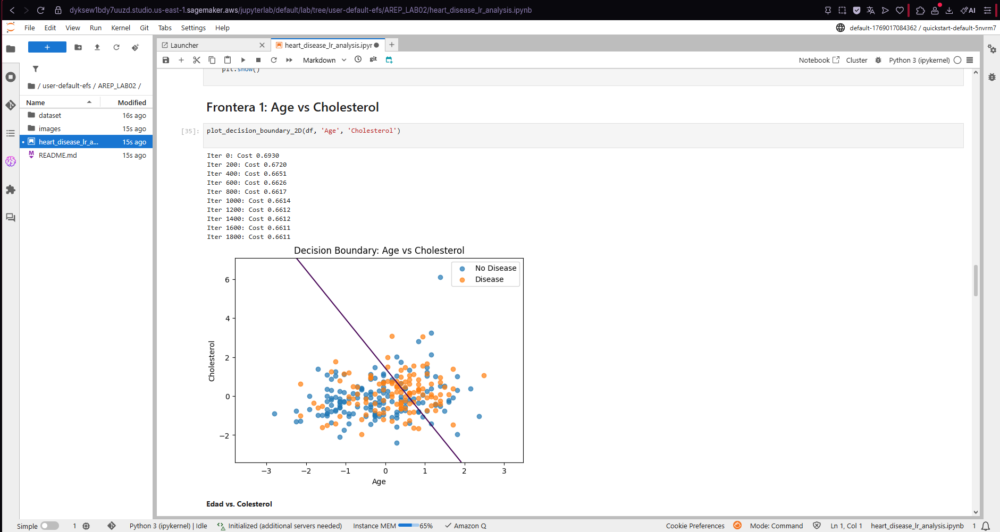
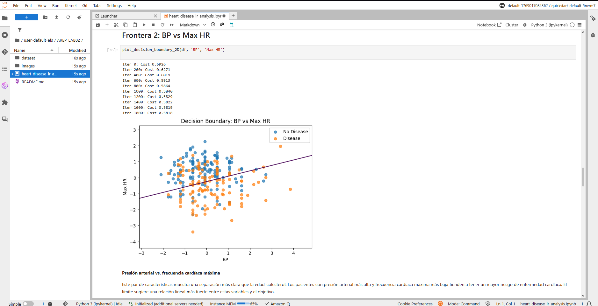
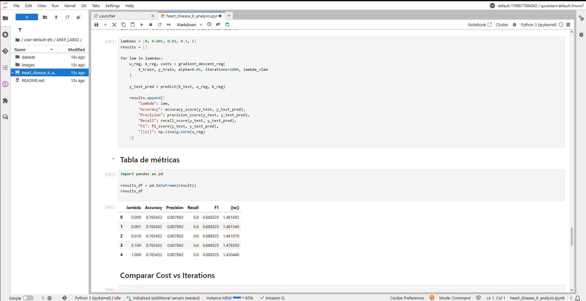
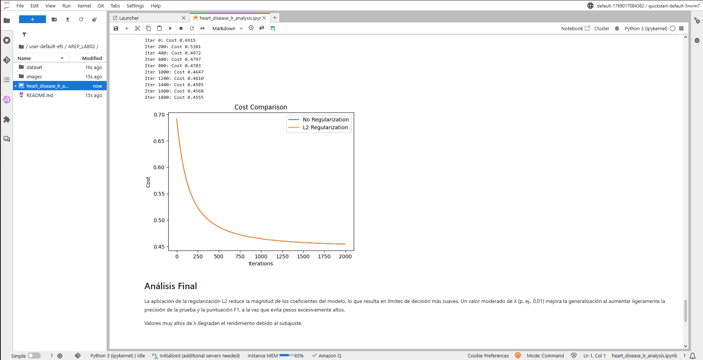

# Predicción de Riesgo de Enfermedad Cardíaca usando Regresión Logística

Este proyecto implementa una regresión logística desde cero usando NumPy para predecir la presencia de enfermedad cardíaca a partir de datos clínicos como edad, presión arterial y colesterol. Incluye preparación de datos, entrenamiento del modelo, regularización, visualización de fronteras de decisión, evaluación con métricas y una breve exploración del despliegue en Amazon SageMaker.

## Primeros pasos

Estas instrucciones permiten ejecutar el proyecto de forma local para desarrollo y pruebas. El modelo fue implementado en Python sin usar librerías de machine learning de alto nivel, con el fin de comprender mejor cómo funciona la regresión logística desde sus bases.

## Prerequisitos

Para ejecutar este proyecto se requiere tener instalado lo siguiente:

- Python 3.8 o superior  
- Anaconda o Miniconda (recomendado)
- Jupyter Notebook o Visual Studio Code con soporte para Python

Librerías necesarias:

```bash
pip install numpy pandas matplotlib
pip install scikit-learn
```

## Instalación

Para configurar el entorno de desarrollo, siga los siguientes pasos:

1. Clonar el repositorio:
```bash
git clone https://github.com/Yojhan-Toro/AREP_LAB02.git
```
2. Ingresar al directorio del proyecto:
```bash
cd heart-disease-logistic-regression
```
3. Abrir el notebook:
```bash
jupyter notebook
```
4. Ejecutar las celdas en orden para:
- Cargar y preprocesar el dataset
- Entrenar el modelo de regresión logística
- Evaluar métricas de desempeño
- Visualizar la convergencia del costo y las fronteras de decisión

Al finalizar, el sistema muestra métricas como accuracy, precision, recall y F1-score, además de gráficas que permiten analizar el comportamiento del modelo.

## Ejecución de pruebas

El proyecto evalúa su funcionamiento mediante pruebas de extremo a extremo basadas en métricas de clasificación. Estas pruebas verifican que el modelo entrene correctamente, que el descenso por gradiente converja y que las predicciones sean consistentes sobre datos no vistos.

Ejemplo de evaluación:
```bash
y_test_pred = predict(X_test, w, b)
accuracy(y_test, y_test_pred)
```

El código está organizado de forma modular, separando funciones de costo, gradientes y optimización, lo cual facilita la lectura, depuración y mantenimiento del proyecto.

## Desarrollo

El modelo entrenado puede exportarse y desplegarse en Amazon SageMaker. El proceso incluye guardar los pesos del modelo y los parámetros de normalización, subirlos a una instancia de SageMaker y crear un script de inferencia que permita realizar predicciones en tiempo real a partir de datos clínicos de pacientes. Este despliegue permite usar el modelo como un servicio escalable para apoyo a la toma de decisiones médicas.

## Construido con
 - Python – Lenguaje de programación
 - NumPy – Cálculo numérico
 - Pandas – Manipulación de datos
 - Matplotlib – Visualización de resultados
 - Amazon SageMaker – Despliegue del modelo

### Despliegue en Amazon SageMaker

A continuación se muestran algunos pantallazos del proceso de despliegue del modelo:










 ## Autoría
 Yojhan Toro Rivera – Implementación inicial, análisis y documentación